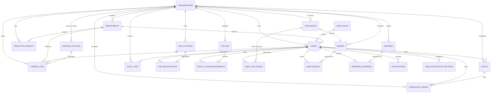

# EcoSphere ESG Management Platform: System Architecture Document

This document defines the high-level software architecture, folder structures, database relationships, and scalability strategies for **EcoSphere**, an enterprise-grade ESG (Environmental, Social, and Governance) Management Platform.

---

## 1. System Design & Layered Architecture

EcoSphere is structured as a decoupled web application containing a **React SPA Frontend** and a **Node.js + Express + Prisma Backend**, communicating over an authenticated **REST API** with a **PostgreSQL** database.

### 1.1 Architecture Topology
```
┌────────────────────────────────────────────────────────┐
│                   React Client SPA                     │
│  ┌─────────────────┐ ┌─────────────────┐ ┌──────────┐  │
│  │  Pages & Views  │ │   Components    │ │  Context │  │
│  └────────┬────────┘ └────────┬────────┘ └────┬─────┘  │
└───────────┼───────────────────┼───────────────┼────────┘
            │                   │ Axios         │
            ▼                   ▼               ▼
┌────────────────────────────────────────────────────────┐
│                   Express API Gateway                  │
│       [Rate Limiter] ──► [CORS] ──► [JWT Auth/RBAC]    │
└───────────────────────────┬────────────────────────────┘
                            │
                            ▼
┌────────────────────────────────────────────────────────┐
│                   Application Services                 │
│  ┌───────────────────────┐   ┌──────────────────────┐  │
│  │   Business Services   │   │  Calculation Engine  │  │
│  │ (Audit, CSR, Gamify)  │   │  (Carbon, ESG Score) │  │
│  └───────────┬───────────┘   └──────────┬───────────┘  │
└──────────────┼──────────────────────────┼──────────────┘
               │                          │
               ▼                          ▼
┌────────────────────────────────────────────────────────┐
│                Prisma ORM Data Access                  │
│  ┌──────────────────────────────────────────────────┐  │
│  │  Repositories (CRUD, Org Filter Enforcement)     │  │
│  └────────────────────────┬─────────────────────────┘  │
└───────────────────────────┼────────────────────────────┘
                            │
                            ▼
┌────────────────────────────────────────────────────────┐
│                   Database & Caching                   │
│   ┌──────────────────────────┐  ┌──────────────────┐   │
│   │     PostgreSQL (3NF)     │  │  Redis (Cache)   │   │
│   └──────────────────────────┘  └──────────────────┘   │
└────────────────────────────────────────────────────────┘
```

### 1.2 Backend Design Pattern: Controller-Service-Repository
To ensure separation of concerns, the backend enforces a strict layered pattern:

1. **Controllers (Routing & Validation Layer)**:
   - Handle incoming HTTP requests.
   - Run input schema validations (using `Zod` or similar library).
   - Extract JWT claims (user context, role, organization) and pass them as flat parameters to the services.
   - Return clean, standardized HTTP responses (JSON).

2. **Services (Business & Calculation Layer)**:
   - Orchestrate business logic, transaction boundaries, and mathematical computations.
   - Compute carbon logs (`activity * factor`) and ESG scores.
   - Trigger asynchronous tasks (e.g., dispatching notifications, checking badge unlocking conditions) via events.
   - Do not contain any direct SQL or express-specific objects (like `req` or `res`).

3. **Repositories (Data Access Layer via Prisma)**:
   - Abstract the database schema from services.
   - Enforce multi-tenant scopes dynamically by appending `where: { organization_id }` constraints to all database queries.
   - Manage physical database transactions.

---

## 2. Multi-Tenancy Architecture

EcoSphere is architected from day one as a **Multi-Tenant Software-as-a-Service (SaaS)** system using a **Shared Database, Shared Schema** design. This approach maximizes resource efficiency, simplifies migrations, and supports rapid scaling.

### 2.1 Tenant Isolation Mechanism
- **Database Partitioning**: All tables containing tenant data are partitioned logically with a foreign key: `organization_id UUID REFERENCES organizations(id) ON DELETE CASCADE`.
- **Tenant Context Resolution**: 
  - Every API request must include a Bearer JWT token in the Authorization header.
  - The JWT token payload contains:
    ```json
    {
      "userId": "d3b07384-d113-49cd-a5d6-8ee44b80b72f",
      "orgId": "a9a8c3d1-443b-48cd-8a47-ea64e7235b2e",
      "role": "ORG_ADMIN"
    }
    ```
  - The authentication middleware decodes this token and attaches the properties to the request context object (`req.user`).
  - Services and repositories receive `orgId` as an explicit parameter in every method execution, ensuring data from Organization A can never bleed into queries for Organization B.

### 2.2 Global Tables
A few metadata tables remain global (shared across all tenants but read-only to non-super-admins):
- `user_roles`: Standardized roles across the entire platform.
- `emission_factors`: Core carbon factors (e.g., standard EPA, IPCC tables). Note: Organizations can override or upload custom factors, which will link directly to their specific `organization_id`.
- `badges`: Standard gamification rules. Organizations can also create tenant-specific badges.

---

## 3. Production Directory Structures

### 3.1 Backend Directory Layout (Node.js + Express + Prisma)
```
ecosphere-backend/
├── prisma/                         # Database schema and migration tracking
│   ├── schema.prisma               # Prisma schema defining database entities
│   ├── seed.ts                     # Database seeder for developer setup
│   └── migrations/                 # Automated SQL migration history
├── src/
│   ├── config/                     # Application configurations (DB, Redis, JWT)
│   │   ├── database.ts
│   │   ├── env.ts
│   │   └── redis.ts
│   ├── constants/                  # System-wide static variables and enums
│   ├── controllers/                # HTTP request handlers (Validation & Routing mapping)
│   │   ├── auth.controller.ts
│   │   ├── carbon.controller.ts
│   │   ├── compliance.controller.ts
│   │   └── gamify.controller.ts
│   ├── middlewares/                # Express middleware pipeline
│   │   ├── auth.middleware.ts      # JWT verification
│   │   ├── rbac.middleware.ts      # Permission checks
│   │   ├── error.middleware.ts     # Global central error handling (RFC 7807)
│   │   └── rate-limiter.ts         # DDOS/Brute-force protection
│   ├── models/                     # Custom Zod schemas for input validation
│   │   └── request-validation/
│   ├── repositories/               # Prisma wrappers enforcing tenant boundaries
│   │   ├── base.repository.ts
│   │   ├── carbon.repository.ts
│   │   └── user.repository.ts
│   ├── routes/                     # Express route mapping definitions
│   │   ├── index.ts
│   │   ├── auth.routes.ts
│   │   ├── carbon.routes.ts
│   │   └── governance.routes.ts
│   ├── services/                   # Pure business logic and ESG calculations
│   │   ├── carbon.service.ts
│   │   ├── esg-calculator.service.ts
│   │   ├── gamification.service.ts
│   │   ├── notification.service.ts
│   │   └── policy.service.ts
│   ├── utils/                      # Helper scripts (formatting, math, cryptography)
│   │   ├── logger.ts               # Winston/Pino logger config
│   │   └── token.ts
│   ├── app.ts                      # Express app setup (cors, helmet, body-parser)
│   └── server.ts                   # Entrypoint: TCP server listener execution
├── tests/                          # Automated testing suites
│   ├── integration/
│   └── unit/
├── package.json
└── tsconfig.json
```

### 3.2 Frontend Directory Layout (React + Vite + Tailwind)
```
ecosphere-frontend/
├── public/                         # Static assets (favicons, public images)
├── src/
│   ├── assets/                     # Shared images, SVGs, animation files
│   ├── components/                 # Reusable Presentational UI Components
│   │   ├── common/                 # Buttons, Inputs, Modals, Loaders
│   │   │   ├── Button.tsx
│   │   │   └── Input.tsx
│   │   ├── dashboard/              # Dashboard-specific layout widgets
│   │   │   ├── KPICard.tsx
│   │   │   └── CarbonTrendChart.tsx
│   │   └── gamification/           # Badges display, leaderboards list
│   │       ├── BadgeGrid.tsx
│   │       └── DepartmentRank.tsx
│   ├── context/                    # Context providers for global react state
│   │   ├── AuthContext.tsx         # User authentication state
│   │   └── ThemeContext.tsx        # Dark/light styling overrides
│   ├── hooks/                      # Custom hooks wrapping React Query logic
│   │   ├── useAuth.ts
│   │   ├── useCarbonLogs.ts
│   │   └── useCompliance.ts
│   ├── layouts/                    # Layout shells (Navbar, Sidebar, Footer)
│   │   ├── AppLayout.tsx           # Authenticated view wrapper
│   │   └── AuthLayout.tsx          # Login/Register view wrapper
│   ├── pages/                      # Top-level Page Views (routed directly)
│   │   ├── Dashboard.tsx
│   │   ├── Environmental.tsx
│   │   ├── Social.tsx
│   │   ├── Governance.tsx
│   │   ├── Gamification.tsx
│   │   └── Login.tsx
│   ├── routes/                     # React Router configurations (Protected & Public)
│   │   └── index.tsx
│   ├── services/                   # Axios instances mapping endpoints
│   │   ├── api-client.ts
│   │   ├── auth.service.ts
│   │   └── carbon.service.ts
│   ├── styles/                     # Tailwind CSS entry points
│   │   └── index.css
│   ├── utils/                      # Date formatters, math utilities, validators
│   ├── App.tsx                     # Main App component wrapping providers
│   └── main.tsx                    # React DOM renderer entry point
├── tailwind.config.js
├── tsconfig.json
└── vite.config.ts
```

---

## 4. Entity Relationship Diagram (ERD)

The following Mermaid diagram visualizes the structure of the database. It models exactly 22 database tables detailing operations, compliance tracking, and gamification:



---

## 5. Future Scalability Plan

To ensure the platform handles growth from a few hundred users in a single hackathon demo to thousands of multi-national enterprise tenants, the system incorporates the following structural strategies:

### 5.1 Redis Caching Layer
To prevent read-heavy components from overwhelming PostgreSQL:
- **Leaderboards**: The Gamification Leaderboard is read hundreds of times per minute by competitive employees. It will be cached in Redis as a Sorted Set (`ZSET`) and recalculated incrementally via event listeners.
- **Reference Data**: Global Emission Factors are static. They will be cached in Redis with a long TTL (e.g., 24 hours), avoiding database lookups during carbon calculation loops.
- **Session Tokens**: JWT blacklists for revoked tokens are stored in Redis with matching TTL expirations.

### 5.2 Asynchronous Background Processing (BullMQ + Redis)
Any logic that takes longer than 100ms or requires external network integration will be delegated to background workers:
- **Badge Triggering Engine**: Rather than executing badge checking rules synchronously inside the Carbon Log API handler, we push a `badge-evaluation` job to BullMQ. The user gets a rapid response, and the worker analyzes badge criteria asynchronously.
- **Email Notifications**: Dispatching emails via SMTP is outsourced to background queues.
- **Heavy PDF Reports**: Compiling ESG compliance reports will run in a worker, notifying the user via an in-app notification when ready for download.

### 5.3 PostgreSQL Database Partitioning
As historical log records build up:
- **Time-based Partitioning**: `carbon_logs`, `audit_logs`, and `notifications` tables will be partitioned by year or month. PostgreSQL handles partition pruning automatically, keeping queries against active data fast while archiving older logs.
- **Tenant-based Indexing**: Standard composite indexes like `CREATE INDEX idx_carbon_org_date ON carbon_logs(organization_id, log_date DESC)` ensure index traversal remains localized to individual organization scopes.
