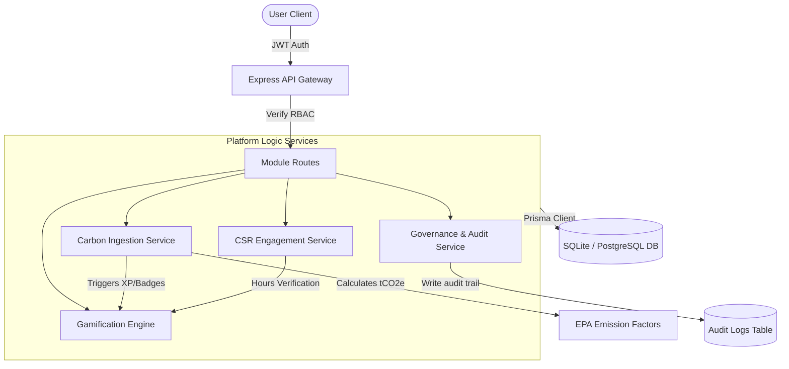

# EcoSphere: Comprehensive Project Documentation & Analysis

This document provides a detailed breakdown of the **Problem Statement**, **Solution Design**, **Website Interface Walkthrough**, and **Architectural Blueprint** of the **EcoSphere ESG Management Platform**.

---

## 1. The Problem Statement: The Corporate ESG Challenge

In modern enterprise environments, Environmental, Social, and Governance (ESG) performance has evolved from a voluntary corporate social responsibility (CSR) exercise into a **strict financial and regulatory mandate**. Global directives (such as the CSRD in Europe and SEC reporting rules in the USA) demand that companies present audit-ready, precise, and transparent ESG disclosures.

However, organizations face critical operational challenges when trying to track and improve their ESG scores:

### A. Fragmented Data & Silos (The "E" Challenge)
* Carbon emissions data (Scope 1, 2, and 3) is typically scattered across utility bills, fuel invoices, travel databases, and supply chain spreadsheets.
* Organizations lack a centralized ledger to calculate raw metrics (kWh, gallons, miles) into standardized metric tons of CO2 equivalent ($tCO_2e$) in real time.

### B. Lack of Employee Engagement (The "S" Challenge)
* Sustainability initiatives are frequently top-down corporate mandates that fail to engage the general workforce.
* Volunteer programs (CSR) suffer from low participation because there is no visibility, incentives, or recognition for employee contributions.

### C. Greenwashing & Audit Vulnerability (The "G" Challenge)
* Without a formal audit trail, ESG data is vulnerable to scrutiny and accusations of "greenwashing" (inflating environmental performance).
* Compliance policies are distributed via email, offering no proof of employee read-receipts or acknowledgement.
* Compliance infractions lack structured resolution paths, tracking, and escalations.

---

## 2. The Solution: EcoSphere Platform

**EcoSphere** is an enterprise-grade ERP system built to capture, evaluate, and gamify corporate ESG operations. It bridges the gap between top-down compliance demands and bottom-up employee participation.

### The Three Operational Pillars of EcoSphere:
1. **Audit-Ready Data Ledger**: All operational inputs (utility usage, CSR hours, policy signings) pass through a dual-approval or verification workflow. Data is locked once finalized, creating an immutable history.
2. **Dynamic ESG Aggregation**: Scores for Environmental, Social, and Governance compliance are calculated in real time based on active records, giving executives up-to-date insight into the company's ESG score (out of 100).
3. **Event-Driven Gamification**: Gamification is deeply integrated into operational transactions. When a carbon log is approved or a policy is signed, the backend transaction triggers point payouts (XP), levels advancement, and badge checks.

---

## 3. Web Interface Walkthrough: The User Experience

The web application is designed with premium corporate aesthetics, combining sleek typography (Google Fonts Outfit), vibrant status signals, subtle animations, and glassmorphic panels.

### 🌐 1. Subdomain Portal & Authentication
* **What it is**: The entrance page to the platform.
* **How it works**:
  * Users enter their corporate credentials. The portal automatically resolves the organization context dynamically based on the email domain (e.g., logging in with `admin@ecocorp.com` assigns the session to **EcoCorp Enterprises**).
  * On successful authentication, the backend issues a signed JWT containing the user's role (`SUPER_ADMIN`, `ORG_ADMIN`, `DEPT_MANAGER`, `AUDITOR`, `EMPLOYEE`), department membership, and organization ID.

---

### 📊 2. Executive ESG Dashboard
* **What it is**: The high-level landing page displaying performance indicators (KPIs) and analytical trends.
* **Key Features**:
  * **Unified ESG Rating**: A large radial meter showing the organization's composite rating (0-100) calculated from three weighted subscores.
  * **Environmental Score widget**: Displays calculated Scope emissions.
  * **Social Impact widget**: Displays volunteer hours logged per employee.
  * **Governance Score widget**: Shows the percentage of active policies acknowledged and compliance issues resolved.
  * **Emissions Trend Area Chart**: An interactive Recharts graph plotting $tCO_2e$ emissions over time, helping executives spot seasonal spikes.
  * **Sub-Score Breakdown Radar Chart**: Displays the strengths and weaknesses of the organization across different dimensions.

---

### 🍃 3. Environmental Accounting Panel
* **What it is**: The operational center for tracking greenhouse gas emissions.
* **Key Features**:
  * **Ingest Carbon Form** (Managers & Admins only):
    * Standardized drop-down selectors for Scope category (Scope 1: Direct Fuels, Scope 2: Grid Electricity, Scope 3: Value Chain).
    * Input of raw operational metrics (e.g., 50,000 kWh, 2,000 gallons).
    * Link to EPA/DEFRA Emission Factor multipliers with live math calculation previews.
  * **Historical Emissions Ledger**:
    * A list of all logged activity records showing: Date, Description, Category, Raw Quantity, Calculated Footprint ($tCO_2e$), and Status.
    * **State-Controlled Actions**: Pending logs display "Approve/Reject" buttons for managers. Approved or rejected logs are immediately locked and toggle the organization's aggregate environmental scores.

---

### 🤝 4. Social Impact Portal
* **What it is**: The interface where employees engage in volunteer work and social impact campaigns.
* **Key Features**:
  * **CSR Activity Board**: A card grid listing open corporate CSR initiatives (e.g., Tree Planting, Diversity Workshops) with status filters.
  * **Participation & Hours Logging**:
    * Employees click "Register" to enroll.
    * A logging panel lets participants record their volunteering hours and upload a verification evidence URL.
  * **Verification Workflow**: Submissions are marked as `PENDING` until an administrator approves the claim, after which the hours are officially counted and XP points are paid out.

---

### ⚖️ 5. Governance Desk & Audit Logs
* **What it is**: The control center for compliance, auditing, and corporate transparency.
* **Key Features**:
  * **Policy Compliance Ledger**:
    * Lists all active corporate regulatory policies (e.g., Code of Conduct, Net-Zero Blueprint).
    * Shows the organization-wide signature compliance rate.
    * Displays a prominent "Acknowledge Policy" button for users who haven't signed yet.
  * **Compliance Issue Board (Kanban style)**:
    * Displays active audit findings, categorized by severity (`LOW`, `MEDIUM`, `HIGH`, `CRITICAL`) and status (`OPEN`, `RESOLVED`, `OVERDUE`).
    * Admins and auditors can log new compliance issues with custom deadlines and owners.
  * **Immutable Database Audit Trail**:
    * A read-only audit log viewer for auditors, printing every system action, user ID, target entity, pre-state data, post-state modifications, client IP address, and browser client footprint.

---

### 🏆 6. Gamification Arena
* **What it is**: The workspace for employee motivation, badges, and rewards.
* **Key Features**:
  * **Level Progression Bar**: Displays the employee's current level and total XP, with logarithmic indicators showing the distance to the next level.
  * **Unlocking Badges Grid**: Lists earned and locked achievements, styled with badges (e.g., *Carbon Crusher* for logging carbon data, *Compliance Guardian* for signature completion).
  * **Active Challenges Checklists**: Shows time-limited objectives (e.g., "Log 5 Electricity Bills this Month") with progress bars.
  * **Points Store (Rewards Catalog)**:
    * Users browse corporate rewards (e.g., Green Merchandising, Extra Time-Off, Sustainable gift cards) showing XP costs and stocks.
    * **Atomic Redemption**: Clicking "Redeem" triggers a transactional deduction of XP and a decrease in stock on the backend database.
  * **Leaderboards**: Displays top-performing employees and departments by total XP, encouraging healthy corporate competition.

---

## 4. Operational Comparison: SQLite vs. PostgreSQL

| Feature | SQLite (Local Dev Fallback) | PostgreSQL (Production) |
| :--- | :--- | :--- |
| **Storage Mechanism** | Single local binary file (`dev.db`). | Multi-user database server (local/cloud). |
| **Setup Dependency** | Zero setup. Instantly boots on schema synchronization. | Requires PostgreSQL service running or Docker compose up. |
| **Enum Support** | Enums are represented as `String` inside the schema and checked using typescript code level enums. | Schema enums are mapped to database native enum types. |
| **Concurrency** | Single-threaded writer locks. Ideal for developer verification. | Multi-row transaction locking. Designed for high enterprise traffic. |
| **Indexes & Keys** | Standard indexes. | Highly optimized composite indexes, UUID columns, and timezone-aware timestamps. |
